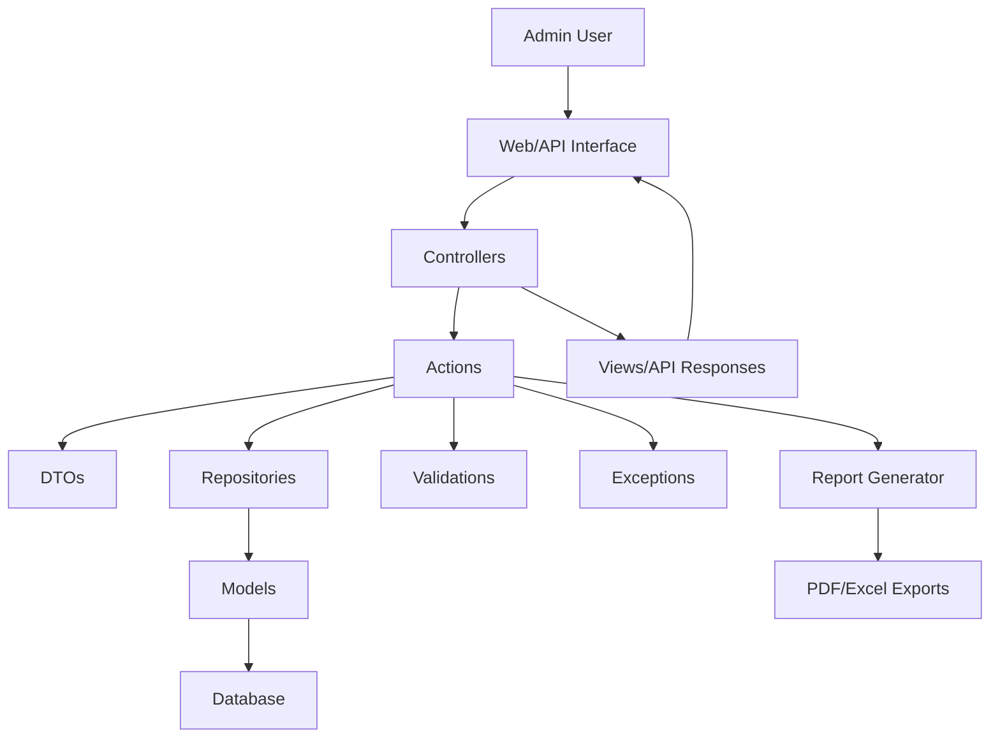

# OJT Application System Plan

## Overview
This Laravel-based system manages On-the-Job Training (OJT) applications, including student groups (1-3 members), panel evaluations (3 roles: Adviser, Chair Panel, Critique), grading, ETL computations, status updates, and report generation. It includes user authentication for admin access, API endpoints, and a modular DDD architecture for scalability.

## Key Functionalities
1. **Import Sheet**: Upload data for student groups (1-3 students), panel members (exactly 3 roles: Adviser, Chair Panel, Critique), and school year.
2. **ETL Computation**: Calculate Equivalent Teaching Load (ETL) for panel members. ETL values: Adviser = 0.5, Chair Panel = 0.3, Critique = 0.3 per group. Total ETL = sum of role values across assigned groups.
3. **Report Exporting**: Generate ETL reports, CAP progress reports (CAP1 to CAP2 by school year), and general reports.
4. **Group Member Management**: Edit/add members with required reasons; update status and transfer to CAP2 upon grading; optional titles in CAP1.
5. **Panel Changes**: Handle panel member changes due to natural reasons (resignation, illness).
6. **Grading Encoding**: Input grades, perform computations, enable exports.
7. **CAP2 Completion**: Customizable checklist, hard bound receipt generation, soft copy export, approval sheet.

## Technology Stack
- **Framework**: Laravel (latest stable version)
- **Database**: MySQL
- **Frontend**: Blade templates with Bootstrap 5 for responsive UI, optional Vue.js for interactivity
- **Reports**: Laravel packages like barryvdh/laravel-dompdf for PDF generation
- **Data Import/Export**: Laravel Excel (maatwebsite/excel) for CSV/Excel handling
- **Authentication**: Laravel Sanctum or built-in auth for admin users
- **Testing**: PHPUnit for unit and feature tests

## System Architecture
The system adopts a Domain-Driven Design (DDD) approach with modular organization:
- **Domains**: Organized into `app/Domains` with subfolders for Students, Groups, Panels, Evaluations, Reports, ETL
- **Actions**: Business logic encapsulated in `app/Actions` (e.g., ComputeETLAction, UpdateGroupStatusAction)
- **DTOs**: Data Transfer Objects in `app/DTOs` for clean data handling
- **Repositories**: Data abstraction layer in `app/Repositories` with interfaces and implementations
- **Validations**: Centralized in `app/Validations` using custom request classes
- **Exceptions**: Error handling in `app/Exceptions` with custom classes and global handlers
- **Controllers**: Thin controllers handling HTTP requests, delegating to actions
- **Models**: Eloquent models with relationships
- **Views**: Blade templates
- **Routes**: Web and API routes for functionality

### Database Schema
- `school_years` (id, year, start_date, end_date)
- `panel_members` (id, name, email, etl_base, status, role)  // role: Adviser/Chair Panel/Critique
- `students` (id, name, student_id)
- `groups` (id, school_year_id, cap_status, title_optional)
- `group_students` (group_id, student_id)
- `group_panels` (group_id, panel_member_id, role)
- `evaluations` (id, group_id, panel_member_id, student_id, grade, criteria, date)
- `changes_log` (id, group_id, change_type, old_value, new_value, changed_by, timestamp)
- `reports` (id, school_year_id, type, data, generated_at)

### User Interface Design
- **Dashboard**: Overview of groups, pending tasks, recent reports
- **Import Page**: File upload form with validation
- **Groups Management**: List view with edit/add functionality
- **Grading Page**: Forms for encoding grades per group
- **Reports Page**: Filters and export options
- **CAP2 Completion**: Checklist management and document generation

## Implementation Plan
1. **Phase 1: Laravel Setup and Foundation**
   - Install Laravel and set up project
   - Configure database and run migrations/seeders
   - Implement authentication for admin users
   - Set up DDD structure: Domains, Actions, DTOs, Repositories, Validations, Exceptions

2. **Phase 2: Core Domains and Functionality**
   - Implement Students, Groups, Panels domains with repositories and models
   - Build import functionality using Laravel Excel
   - Develop group management with change logging
   - Create grading and evaluation encoding

3. **Phase 3: Computations and Reports**
   - Implement ETL computation action with succeeding value logic
   - Build report generation with PDF/Excel exports
   - Add status update actions for CAP transitions

4. **Phase 4: Advanced Features and APIs**
   - Develop API endpoints for all functionalities
   - Implement customizable CAP2 checklist
   - Add document exports and approval sheets
   - Centralize validations and error handling

5. **Phase 5: Testing, UI, and Deployment**
   - Write unit and feature tests
   - Develop Blade/Vue.js UI for key pages
   - Perform security hardening and deployment

## Security Considerations
- Input sanitization and validation
- SQL injection prevention (prepared statements)
- XSS protection
- File upload security
- Single user: no authentication needed, but session management for state

## Design Principles
- Responsive design for various screen sizes
- Intuitive navigation with breadcrumbs
- Consistent styling and error messaging
- Modular code for maintainability
- Performance optimization for report generation

## Files to Create
- Laravel migrations for all tables
- Eloquent models with relationships
- Repository interfaces and implementations
- Action classes for business logic
- DTO classes for data transfer
- Custom request classes for validations
- Exception classes and handlers
- Controllers for web and API routes
- Blade templates for UI
- Vue.js components (optional)
- Test classes for units and features
- Configuration files and seeders

## Mermaid Architecture Diagram

This plan provides a comprehensive blueprint for building the OJT Application system. Implementation will proceed based on user approval.